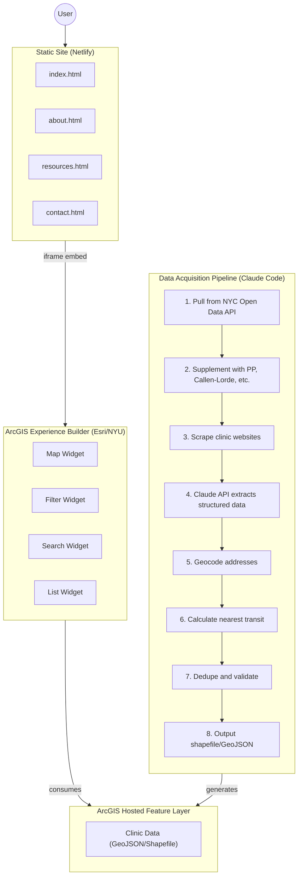

# sexualhealth.nyc — Project Specification

## Status

| Item                           | Status                     |
| ------------------------------ | -------------------------- |
| Domain (sexualhealth.nyc)      | ✅ Registered (Porkbun)    |
| Email (hello@sexualhealth.nyc) | ✅ Set up (Zoho Mail Lite) |
| DNS (MX, SPF, DKIM)            | ✅ Configured              |
| Netlify hosting                | ✅ Deployed                |
| GoatCounter analytics          | ✅ Set up                  |
| Static site                    | ⏳ Placeholder only        |
| ArcGIS Experience Builder app  | ⏳ Not started             |
| Data pipeline                  | ⏳ Not started             |
| Data collection                | ⏳ Not started             |

---

## Overview

An interactive map of all sexual health clinics in NYC with filterable metadata: insurance acceptance, services offered, hours, walk-in availability, and nearby transit options.

**Domains:**

- Primary: `sexualhealth.nyc`
- Redirect: `sexualhealthnyc.com` → `sexualhealth.nyc`

**Why this matters:**
Existing resources (NYC Health Map, HIV.gov locator, Planned Parenthood finder) are fragmented and lack:

- Comprehensive coverage (no single source aggregates all providers)
- Insurance filtering (Medicaid vs. no-insurance-required vs. specific plans)
- Service filtering (PrEP, abortion, gender-affirming care in one place)
- Transit integration
- Walk-in vs. appointment filtering

---

## Architecture



**URLs:**

- Static site: `sexualhealth.nyc` (Netlify)
- ArcGIS app: `experience.arcgis.com/...` (hosted by Esri via NYU license)

---

## Phase 1: Initial Data Collection (One-Time)

### Goal

Generate comprehensive, accurate dataset with ~100-200 clinic locations and rich metadata.

### Data Schema

| Field               | Type    | Notes                                                                                                          |
| ------------------- | ------- | -------------------------------------------------------------------------------------------------------------- |
| `name`              | string  | Clinic name                                                                                                    |
| `address`           | string  | Full street address                                                                                            |
| `borough`           | string  | Manhattan, Brooklyn, Queens, Bronx, Staten Island                                                              |
| `latitude`          | float   | WGS84                                                                                                          |
| `longitude`         | float   | WGS84                                                                                                          |
| `phone`             | string  | Primary contact                                                                                                |
| `website`           | string  | Clinic URL                                                                                                     |
| `clinic_type`       | string  | DOH, Planned Parenthood, FQHC, LGBTQ+ Center, Hospital, Private                                                |
| `services`          | string  | Comma-separated: STI testing, HIV testing, PrEP, PEP, contraception, abortion, gender-affirming care, vaccines |
| `insurance_types`   | string  | Comma-separated: Medicaid, Medicare, Private, Sliding Scale                                                    |
| `no_insurance_ok`   | boolean | Can be seen without insurance?                                                                                 |
| `hours`             | string  | Human-readable hours                                                                                           |
| `walk_in`           | boolean | Walk-ins accepted?                                                                                             |
| `appointment_only`  | boolean | Appointment required?                                                                                          |
| `languages`         | string  | Comma-separated                                                                                                |
| `lgbtq_focused`     | boolean | Specifically LGBTQ+ focused?                                                                                   |
| `youth_friendly`    | boolean | Serves teens / no parental consent needed?                                                                     |
| `anonymous_testing` | boolean | Anonymous testing available?                                                                                   |
| `nearest_subway`    | string  | e.g., "A/C/E at 14th St (0.2 mi)"                                                                              |
| `nearest_bus`       | string  | e.g., "M14A, M14D (0.1 mi)"                                                                                    |
| `last_verified`     | date    | When data was last checked                                                                                     |
| `notes`             | string  | Special info (closures, express testing, etc.)                                                                 |

### Data Sources

**Base clinic lists (APIs / structured data):**

| Source                  | What it provides                         | Access                                 |
| ----------------------- | ---------------------------------------- | -------------------------------------- |
| NYC Open Data (Socrata) | Health facilities, addresses             | Open API, no auth needed, 1000 req/day |
| HRSA Data Warehouse     | Federally Qualified Health Centers       | Open API                               |
| NYC Health Dept         | DOH sexual health clinics (~6 locations) | Scrape from nyc.gov                    |

**Supplemental sources (scraping required):**

| Source                               | Locations | URL                   |
| ------------------------------------ | --------- | --------------------- |
| Planned Parenthood NYC               | ~10       | plannedparenthood.org |
| Callen-Lorde                         | 4         | callen-lorde.org      |
| GMHC                                 | 1         | gmhc.org              |
| Community Healthcare Network         | ~14       | chnnyc.org            |
| The Door (youth)                     | 1         | door.org              |
| Mount Sinai Adolescent Health Center | 1         | mountsinai.org        |
| Alliance for Positive Change         | Multiple  | apcnyc.org            |

**Enrichment data:**

| Data            | Source                     | Format  |
| --------------- | -------------------------- | ------- |
| Subway stations | MTA GTFS / NYC Open Data   | GeoJSON |
| Bus stops       | MTA GTFS                   | GeoJSON |
| Geocoding       | Nominatim (free) or Google | API     |

### Technical Approach

**Tools:**

- Python: `requests`, `beautifulsoup4`, `geopandas`, `pandas`
- Claude API for structured extraction from unstructured HTML
- Nominatim for geocoding (free, no API key)
- Output: Shapefile (.shp, .shx, .dbf, .prj) or GeoJSON

**LLM extraction prompt pattern:**

```
Given this HTML from a clinic website, extract:
- Services offered (list)
- Insurance types accepted (list)
- Whether insurance is required (yes/no)
- Hours of operation
- Walk-in or appointment required
- Languages spoken

Return as JSON.

HTML:
{html_snippet}
```

### Deduplication Strategy

**The problem:** Same clinic may appear in multiple sources (NYC Open Data, HRSA, provider websites) with slightly different names/addresses.

**Step 1: Normalize addresses**

```python
def normalize_address(addr):
    addr = addr.lower().strip()
    addr = addr.replace(" street", " st")
    addr = addr.replace(" avenue", " ave")
    addr = addr.replace(" boulevard", " blvd")
    addr = addr.replace(" floor", " fl")
    addr = re.sub(r'\s+', ' ', addr)  # collapse whitespace
    addr = re.sub(r'[^\w\s]', '', addr)  # remove punctuation
    return addr
```

**Step 2: Geocode everything**
All records get lat/long via Nominatim. This is the primary matching key.

**Step 3: Cluster by proximity**
Group records within 50 meters of each other — likely the same location.

**Step 4: Fuzzy match names within clusters**
Use fuzzy string matching (e.g., `rapidfuzz`) on clinic names within each geographic cluster:

- Score > 85 = likely same clinic
- Score 60-85 = flag for manual review
- Score < 60 = probably different clinics at same address (e.g., building with multiple providers)

**Step 5: Merge records**
For duplicates:

- Keep the record with the most complete metadata
- Fill in missing fields from other records
- Prefer data from authoritative sources (NYC DOH > scraped website)
- Track `data_sources` field listing where info came from

**Step 6: Manual review queue**
Output uncertain matches to a CSV for human review before final import.

**Example duplicate scenarios:**

| Source A                                      | Source B                                 | Action                                         |
| --------------------------------------------- | ---------------------------------------- | ---------------------------------------------- |
| "Callen-Lorde Community Health Center"        | "Callen Lorde CHC"                       | Auto-merge (fuzzy score ~90)                   |
| "NYC Health Dept Chelsea Clinic"              | "Chelsea Sexual Health Clinic"           | Flag for review                                |
| "Mount Sinai Adolescent Health" at 320 E 94th | "Phillips Family Practice" at 320 E 94th | Keep both (different providers, same building) |

### Deliverable

Shapefile ready for import into ArcGIS Online.

---

## Phase 2: Ongoing Maintenance (If Traction)

Only invest in this after proving value (people use it, positive feedback).

### Infrastructure

- PostgreSQL + PostGIS database
- Scheduled scraper (monthly)
- Change detection and alerting
- API endpoint that ArcGIS consumes directly (no manual shapefile uploads)

### Considerations

- Clinic info goes stale fast (hours change, insurance changes, closures)
- Data quality/confidence scores per field

---

## Community Submissions (Phase 1)

Simple approach: email-based, manual updates.

### Process

1. User sends email to `hello@sexualhealth.nyc` with correction or new clinic info
2. We verify the info (check clinic website, call if needed)
3. Update the feature layer in ArcGIS Online
4. Reply to confirm the update

### On the Static Site

Add a "Submit a correction" or "Add a clinic" link on the contact page pointing to `mailto:hello@sexualhealth.nyc?subject=Clinic%20Update`.

No form, no database, no moderation queue. Just email. Revisit if volume becomes unmanageable.

---

## Data Maintenance (ArcGIS)

### Quick Edits (1-2 fields)

Open the feature layer in **Map Viewer** → click the clinic point → edit attributes in the popup → save.

### Bulk Attribute Edits

On the feature layer's item page → **Data tab** → spreadsheet-like interface → edit cells directly → save.

### Add New Clinic

Data tab → click "Add" → fill in fields → save. Or use Map Viewer to drop a new point.

### Full Data Refresh

**Overwrite layer:** Upload a new CSV/GeoJSON/Shapefile to completely replace all data. Use when re-running the data pipeline.

**Append data:** Add new records without replacing existing ones.

### Programmatic Updates (Phase 2)

ArcGIS REST API allows automated updates. Could connect directly to a PostGIS database or scheduled scraper output.

### Survey123 (Phase 2)

If community submissions grow, create a Survey123 form that writes directly to the feature layer — skips the email step, but requires moderation workflow.

---

## Static Site

### Structure

```
sexualhealth.nyc/
├── index.html          # Full-width embedded ArcGIS map
├── about.html          # Project background, methodology
├── resources.html      # Additional resources, hotlines
└── contact.html        # Submit corrections, add a clinic (mailto link)
```

### Accessibility (WCAG 2.1 AA)

The static site wrapper must meet WCAG 2.1 AA compliance:

- **Semantic HTML:** Proper heading hierarchy, landmarks (`<nav>`, `<main>`, `<footer>`), and ARIA labels where needed
- **Keyboard navigation:** All interactive elements focusable and operable via keyboard
- **Color contrast:** Minimum 4.5:1 for normal text, 3:1 for large text
- **Focus indicators:** Visible focus states on all interactive elements
- **Skip links:** "Skip to main content" link for keyboard users
- **Alt text:** Descriptive alt attributes for all images
- **Responsive design:** Usable at 200% zoom, works with screen readers
- **Form labels:** Any mailto links or future forms properly labeled
- **Testing:** Validate with axe DevTools, WAVE, and manual keyboard/screen reader testing

**ArcGIS Experience Builder Accessibility:**

Maps are inherently challenging for screen readers. Esri has partial WCAG support but requires manual configuration:

_Required configuration in Experience Builder:_

- Use full-screen or scrolling page layouts (not free-form drag-and-drop)
- Click A11Y button → enable "Auto-calculate element tab orders"
- Add accessible labels to every widget (Map, Filter, List, Search)
- Use default themes (Prime, Ocean, etc.) which have optimized color contrast
- If customizing colors, maintain 4.5:1 contrast ratio

_Provide non-map alternatives:_

- Include a filterable list view (List widget) alongside the map
- Consider a downloadable CSV of all clinics for screen reader users
- Add text descriptions of what the map shows

_Reference:_ [Esri Accessibility Conformance Report (VPAT)](https://www.esri.com/content/dam/esrisites/en-us/media/legal/vpats/arcgis-experience-builder-10-25-23-vpat.pdf)

### Hosting: Netlify (Free)

- 100GB bandwidth/month (the iframe does the heavy lifting — Esri serves the map tiles/data, Netlify only serves your thin HTML/CSS wrapper)
- 300 build minutes/month
- Custom domain with free SSL
- Dead simple: connect GitHub repo or drag-and-drop a folder

**Bandwidth limits:** Netlify emails you at 50%, 75%, 90%, and 100% of usage. On the free tier, if you hit 100%, the site pauses until the next billing cycle — no surprise charges. It auto-resumes next month.

### Domain Configuration (Porkbun DNS)

1. Point `sexualhealth.nyc` to Netlify via CNAME record
2. Add `sexualhealthnyc.com` and configure redirect → `sexualhealth.nyc` (via Netlify `_redirects` file)
3. HTTPS is automatic with Netlify

### Security Headers (CSP)

`public/_headers` file configures Content-Security-Policy:

```
/*
  Content-Security-Policy: default-src 'self'; frame-src https://experience.arcgis.com https://*.arcgis.com; script-src 'self' https://gc.zgo.at; style-src 'self' 'unsafe-inline'; img-src 'self' data: https:; connect-src 'self'
  X-Frame-Options: DENY
  X-Content-Type-Options: nosniff
  Referrer-Policy: strict-origin-when-cross-origin
  Permissions-Policy: geolocation=(), microphone=(), camera=()
```

| Directive         | Value                                                | Why                                         |
| ----------------- | ---------------------------------------------------- | ------------------------------------------- |
| `frame-src`       | `https://experience.arcgis.com https://*.arcgis.com` | Allows the ArcGIS Experience Builder iframe |
| `script-src`      | `'self' https://gc.zgo.at`                           | Your scripts + GoatCounter                  |
| `X-Frame-Options` | `DENY`                                               | Prevents clickjacking                       |

---

## Email: Zoho Mail Lite ($12/year)

Need to send and receive as `hello@sexualhealth.nyc` — can't have replies coming from a personal address given the sensitive topic.

**What you get:**

- Send and receive as `hello@sexualhealth.nyc`
- IMAP access (shows up in your regular mail client)
- 5GB storage

**Setup:**

1. Create Zoho Mail account, select Lite plan ($1/user/month)
2. Add `sexualhealth.nyc` domain
3. Verify via DNS TXT record (add in Porkbun)
4. Configure MX records (add in Porkbun)
5. Create `hello@sexualhealth.nyc`
6. Configure in mail client via IMAP

**HIPAA / Health Info Disclaimer:**

This site is a directory, not a healthcare provider. HIPAA only applies to covered entities (providers, health plans, clearinghouses). We're not one.

However, people may email health questions anyway. Mitigations:

- Set up auto-reply stating we don't provide medical advice
- Clear disclaimer on contact page (see below)
- Don't store/forward any health-related emails — delete after reading
- Zoho Mail is not HIPAA-compliant, but doesn't need to be for our use case

**Required contact page language:**

> This email is for reporting incorrect clinic information or suggesting additions only. We cannot provide medical advice or answer personal health questions. For health concerns, please contact a clinic directly or call 311.

---

## ArcGIS Components (Free via NYU)

### What NYU license provides:

- ArcGIS Online account
- ArcGIS Experience Builder (no-code web app builder)
- Hosted feature layers
- Geocoding credits
- Base maps (streets, transit, satellite)

### Experience Builder widgets to use:

- **Map widget** — the map itself
- **Filter widget** — dropdowns/checkboxes for insurance, services, etc.
- **Search widget** — find clinics near an address
- **List widget** — scrollable list of filtered results
- **Directions widget** — routing/transit directions

### Data layers to overlay:

- NYC subway lines/stations (from ArcGIS Living Atlas)
- NYC bus routes (from ArcGIS Living Atlas)

---

## Analytics

Two layers, both privacy-preserving:

### ArcGIS Built-in (Free, Automatic)

Every ArcGIS item (the Experience Builder app, the hosted feature layer) has a Usage tab showing:

- View counts over time (up to 1 year history)
- Requests to the data layer
- Average views per day

This is server-side, no JavaScript, no cookies. Good enough to answer "is anyone using this?"

### GoatCounter (Free, Optional)

Add to the static wrapper site for more detail on the landing pages.

- **Cost:** Free for non-commercial use
- **Privacy:** No cookies, GDPR compliant, lightweight script
- **What it shows:** Pageviews, referrers, browsers, countries, screen sizes
- **Setup:** Add one `<script>` tag, create free account at goatcounter.com

Only tracks the static wrapper pages (about, resources, contact). The ArcGIS iframe is tracked separately by Esri's built-in stats.

**Start with ArcGIS built-in stats only.** Add GoatCounter later if you want referrer/geography data.

---

## SEO

### Basics

- **Title tags:** Unique per page, include "NYC" and key terms (e.g., "Free STI Testing NYC | sexualhealth.nyc")
- **Meta descriptions:** ~155 chars, action-oriented (e.g., "Find free and low-cost sexual health clinics in NYC. Filter by insurance, services, walk-in availability, and nearest subway.")
- **Open Graph tags:** For social sharing (og:title, og:description, og:image)
- **Canonical URLs:** Set to avoid duplicate content issues

### Technical

- **sitemap.xml:** Generate and submit to Google Search Console
- **robots.txt:** Allow all (nothing to hide)
- **Mobile responsive:** Critical — most users will be on phones
- **Page speed:** Already fast (static HTML + iframe offloads to Esri)
- **HTTPS:** Automatic via Netlify

### Structured Data (Schema.org)

Add `LocalBusiness` or `MedicalClinic` JSON-LD to help Google understand the content. Can be embedded in the static pages or generated dynamically if we build a clinic detail page later.

```json
{
  "@context": "https://schema.org",
  "@type": "WebSite",
  "name": "sexualhealth.nyc",
  "url": "https://sexualhealth.nyc",
  "description": "Interactive map of sexual health clinics in NYC"
}
```

### Content Strategy

- **About page:** Explain methodology, data sources, update frequency — builds trust and E-E-A-T
- **Resources page:** Link to authoritative sources (NYC DOH, CDC, Planned Parenthood) — good for users and SEO
- **Blog/updates (Phase 2):** If traction, occasional posts about sexual health resources in NYC can drive organic traffic

### Local SEO

- Submit to Google Search Console
- Consider Google Business Profile if applicable (probably not for a directory site)
- Target long-tail keywords: "free STI testing near me NYC", "walk-in PrEP clinic Brooklyn", "no insurance sexual health clinic Queens"

### Limitations

The ArcGIS iframe content is not crawlable by Google. All SEO value comes from the static wrapper pages. This is fine — the wrapper pages describe what the tool does, and users find it via search, then interact with the map.

---

## Open Questions

1. **Scope definition:** What counts as a "sexual health clinic"?
   - Only specialized clinics? (~30-50)
   - Or any clinic offering STI testing/PrEP/etc.? (~150-200)

---

## Timeline (Rough)

| Phase               | Tasks                                     | Duration  |
| ------------------- | ----------------------------------------- | --------- |
| **Data collection** | Run pipeline, generate shapefile          | 1-2 days  |
| **ArcGIS setup**    | Import data, build Experience Builder app | 1 day     |
| **Static site**     | Build wrapper, deploy to Netlify          | Few hours |
| **DNS/Email**       | Configure domains, set up Zoho            | 1-2 hours |
| **Testing**         | QA, mobile testing, feedback              | Ongoing   |

---

## Success Metrics

- People actually use it (basic analytics)
- Positive feedback from target audience
- Professors/advisors impressed (if this is for school)
- Potential: picked up by NYC DOH or community orgs

---

## References

- Previous chat: https://claude.ai/chat/593123d2-f831-4d87-8b59-1450a73f2195
- NYC Open Data API: https://data.cityofnewyork.us
- HRSA Data Warehouse: https://data.hrsa.gov
- NYC Health Map (existing): https://a816-health.nyc.gov/NYCHealthMap
- HIV.gov Locator: https://locator.hiv.gov
- ArcGIS Experience Builder docs: https://doc.arcgis.com/en/experience-builder/
- Netlify docs: https://docs.netlify.com
- Porkbun: https://porkbun.com
- Zoho Mail: https://www.zoho.com/mail/
- GoatCounter: https://goatcounter.com
- Google Search Console: https://search.google.com/search-console
- Schema.org: https://schema.org
