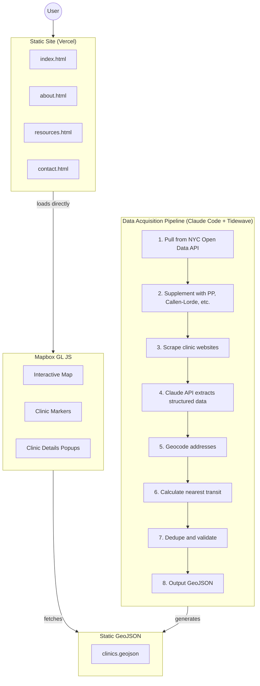

# sexualhealth.nyc — Project Specification

## The Problem

If you need sexual health services in NYC — STI testing, PrEP, abortion care, contraception — there's no single place to find what's available. You have to check:

- NYC Health Department's site (only lists their 6 clinics)
- Planned Parenthood's finder (only their locations)
- HIV.gov locator (only HIV-related services)
- Individual clinic websites

None of these answer the questions people actually have:

- "Can I walk in or do I need an appointment?"
- "Do they take my insurance?"
- "Can I go without insurance?"
- "What's the closest clinic to my subway stop?"
- "Are they LGBTQ+ friendly?"

**Our solution:** One interactive map with every sexual health clinic in NYC, with filters for all the things that actually matter.

---

## What's Already Set Up

| What             | Status         | Details                                                    |
| ---------------- | -------------- | ---------------------------------------------------------- |
| Website domain   | ✅ Done        | sexualhealth.nyc (also sexualhealthnyc.com redirects here) |
| Email            | ✅ Done        | hello@sexualhealth.nyc — check via mail.zoho.com           |
| Placeholder site | ✅ Done        | Live at sexualhealth.nyc (just a "coming soon" page)       |
| Analytics        | ✅ Done        | Stats at sexualhealthnyc.goatcounter.com                   |
| Hosting          | ✅ Done        | Vercel (migrated from Netlify)                             |
| Build system     | ✅ Done        | Vite                                                       |
| Map tool         | ✅ Done        | Mapbox GL JS (switched from ArcGIS)                        |
| Dev tools        | ✅ Done        | Tidewave integrated with Claude Code                       |
| Clinic data      | ⏳ In progress | 124+ clinics collected, needs deduplication                |

---

## What We're Building

The site has two parts:

**1. The map (the main thing)**
An interactive map where users can:

- See all clinics as pins on a map
- Filter by services (STI testing, PrEP, abortion, etc.)
- Filter by insurance (Medicaid, uninsured, etc.)
- Filter by walk-in vs. appointment
- Click a clinic to see details (hours, phone, address)
- Get transit directions

**2. Static pages (the wrapper)**
Simple pages around the map:

- Homepage with the embedded map
- About page (who made this, methodology)
- Resources page (hotlines, other links)
- Contact page (submit corrections)

---

## The Data: What We're Collecting

For each clinic, we need to collect specific information. Here's every field and why it matters:

### Basic Info

| Field        | Example                                | Why we need it                      |
| ------------ | -------------------------------------- | ----------------------------------- |
| Clinic name  | "Callen-Lorde Community Health Center" | Obviously                           |
| Address      | "356 W 18th St, New York, NY 10011"    | For the map location and directions |
| Borough      | "Manhattan"                            | Lets people filter to their borough |
| Phone number | "(212) 271-7200"                       | So people can call                  |
| Website      | "callen-lorde.org"                     | So people can learn more            |

### Services Offered

This is the most important filtering. We need to know if each clinic offers:

| Service               | Why it matters                                                         |
| --------------------- | ---------------------------------------------------------------------- |
| STI testing           | The most common reason people search                                   |
| HIV testing           | Often bundled with STI but not always                                  |
| PrEP                  | HIV prevention pill — not everywhere offers it                         |
| PEP                   | Emergency HIV prevention — time-sensitive, people need to find it fast |
| Contraception         | Birth control                                                          |
| Abortion              | Increasingly hard to find accurate info                                |
| Gender-affirming care | Hormones, etc. — LGBTQ+ community needs this                           |
| Vaccines              | HPV, Hepatitis, etc.                                                   |

### Insurance & Cost

The #1 barrier to care is "can I afford this?" We need:

| Field                         | Why it matters                             |
| ----------------------------- | ------------------------------------------ |
| Accepts Medicaid              | Huge — many low-income NYers have Medicaid |
| Accepts Medicare              | For older adults                           |
| Accepts private insurance     | And ideally which ones                     |
| Sliding scale available       | Reduced cost based on income               |
| Can be seen without insurance | Critical for uninsured people              |

**The Medicaid nuance:** In NYC, "Medicaid" isn't one thing. There's:

- **Straight Medicaid** — direct government coverage
- **Managed Medicaid** — through an MCO like Healthfirst, Fidelis, MetroPlus, etc.

Some clinics accept one but not the other. This is the difference between getting care and getting turned away. If clinic websites list specific MCOs, we'll capture them. If they just say "we accept Medicaid," we'll note it's unverified.

**Verification status:** For insurance especially, we'll track confidence:

- "Confirmed" — verified on website or by phone
- "Listed on website" — site says so but we didn't verify
- "Unknown" — website doesn't say

### Access & Availability

| Field                | Why it matters                |
| -------------------- | ----------------------------- |
| Walk-ins accepted    | Can you just show up?         |
| Appointment required | Or do you need to call ahead? |
| Hours                | When are they open?           |
| Languages spoken     | NYC is multilingual           |

### Special Populations

Some clinics specialize in serving specific communities:

| Field                       | Why it matters                                       |
| --------------------------- | ---------------------------------------------------- |
| LGBTQ+ focused              | Some clinics specialize in this (Callen-Lorde, GMHC) |
| Youth-friendly              | Teens can go without parental consent                |
| Anonymous testing available | Some people need this for safety reasons             |

### Transit

NYC runs on public transit. We'll calculate:

| Field          | Example                     |
| -------------- | --------------------------- |
| Nearest subway | "A/C/E at 14th St (0.2 mi)" |
| Nearest bus    | "M14A, M14D (0.1 mi)"       |

### Metadata

For maintenance:

| Field              | Why                                                          |
| ------------------ | ------------------------------------------------------------ |
| Last verified date | So we know how stale the data might be                       |
| Data sources       | Where did we get this info from?                             |
| Notes              | Anything special (temporary closures, express testing, etc.) |

---

## Where the Data Comes From

We're pulling from multiple sources and combining them. Think of it like assembling a puzzle from different boxes.

### Official Government Data

| Source                         | What we get                                   | Status      | Reliability                   |
| ------------------------------ | --------------------------------------------- | ----------- | ----------------------------- |
| NYC Open Data (HIV Testing)    | 116 HIV testing locations with coords & hours | ✅ Imported | High — already geocoded       |
| NYC Open Data (HIV Services)   | 8 HIV service providers                       | ✅ Imported | High — includes service types |
| NYC Health Dept website (DOH)  | 8 sexual health clinics (manual scrape)       | ✅ Imported | High — official DOH locations |
| HRSA (federal)                 | Federally Qualified Health Centers            | ⏳ TODO     | High — but only FQHCs         |
| NYC Open Data (old shapefiles) | 2009 DOHMH facilities shapefile               | ❌ Dead     | Links broken, data too old    |

**Datasets Used:**

- `72ss-25qh` - HIV Testing Locations (599 total, 116 sexual health filtered)
- `pwts-g83w` - DOHMH HIV Service Directory (71 total, 8 filtered)
- Manual: nyc.gov DOH sexual health clinics page

### Provider Websites (We Have to Scrape)

These don't have APIs — we have to visit their websites and extract the info:

| Organization                  | # of Locations | What they offer          | Status  | Notes                                 |
| ----------------------------- | -------------- | ------------------------ | ------- | ------------------------------------- |
| Planned Parenthood NYC        | ~3-5           | Full range of services   | ⏳ TODO | Website blocks automation (403 error) |
| Callen-Lorde                  | 4              | LGBTQ+ focused           | ⏳ TODO | May need manual entry                 |
| GMHC                          | 1              | HIV/AIDS focused         | ⏳ TODO |                                       |
| Community Healthcare Network  | ~14            | Community health centers | ⏳ TODO |                                       |
| The Door                      | 1              | Youth focused            | ⏳ TODO |                                       |
| Mount Sinai Adolescent Health | 1              | Youth focused            | ⏳ TODO |                                       |

**Note on Planned Parenthood:** Manhattan Health Center closed Oct 31, 2025. Remaining locations in Queens, Brooklyn, and Bronx. Website has anti-scraping protection.

### What "Scraping" Means

We write code that visits each clinic's website and extracts the information (hours, services, insurance) from their pages. It's like copying info from a website, but automated.

The tricky part: every website is different. Planned Parenthood's site is structured differently than Callen-Lorde's. Some sites actively block automated requests (like Planned Parenthood), requiring manual data entry or more sophisticated scraping techniques.

---

## Verifying Data by Phone (Your Team)

Website scraping gets us 60-70% of the way there. The rest requires phone calls. This is where you come in.

### Why Calls Matter

- Many clinics don't list insurance info on their website
- Hours on websites are often outdated
- "Walk-ins welcome" might have changed post-COVID
- Some details (like specific Medicaid MCOs) are never on websites

### Organizing Volunteers

You can recruit friends, classmates, or club members to help. Each person gets a list of clinics to call.

**The pitch to volunteers:**

> "We're building a free resource to help NYers find sexual health services. Can you spend an hour calling 10 clinics to verify their info?"

**What to ask on each call:**

1. "I'm calling from sexualhealth.nyc — we're building a free directory of sexual health clinics in NYC. Can I verify a few details about your services?"
2. Hours of operation
3. Do you accept walk-ins?
4. What insurance do you accept? (Specifically: Medicaid? Which plans?)
5. Can someone be seen without insurance?
6. Do you offer [STI testing / PrEP / etc.]?

### Prioritizing Calls

Not all clinics are equally important to call. Prioritize by:

1. **Missing critical data** — no insurance info, no hours
2. **High-traffic clinics** — Planned Parenthood, DOH clinics
3. **Unverified data** — info scraped from old websites
4. **Stale data** — last verified 6+ months ago

We'll generate a spreadsheet sorted by priority for volunteers to work through.

### Calls as Outreach

Every call is also marketing. When you call, you're:

- **Introducing the site** — "We're sexualhealth.nyc, a free clinic finder"
- **Building relationships** — They may refer patients to the site
- **Creating accountability** — If they know they're listed, they may notify us of changes
- **Getting buy-in** — Some clinics may want to help keep their info current

**Ask at the end of each call:**

> "If your hours or services change, is there someone we can contact to update our listing? Can I get an email?"

This creates a contact list for future updates — way better than re-scraping outdated websites.

### Tracking Call Results

Simple spreadsheet:
| Clinic | Caller | Date | Verified? | Notes | Contact for updates |
|--------|--------|------|-----------|-------|---------------------|

We'll set this up in Google Sheets so multiple people can work on it.

---

## What We Won't Know Until We Start

Some things we can only figure out by doing the work:

### Data Quality Issues

- **Outdated websites:** Some clinics haven't updated their sites in years. The hours might be wrong.
- **Inconsistent info:** One page says "walk-ins welcome" but another says "by appointment only."
- **Missing info:** Many sites don't list what insurance they accept.
- **Vague language:** "We accept most insurance" — what does that mean?

### Scope Questions

- **What counts as a "sexual health clinic"?**
  - Narrow definition (only specialized clinics): ~30-50 locations
  - Broad definition (any clinic offering STI testing): ~150-200 locations
  - We'll need to decide as we go

- **How do we handle hospitals?**
  - Mount Sinai has an STI clinic, but it's inside a giant hospital
  - Do we list the hospital or try to find the specific clinic?

- **Telehealth?**
  - Some services are now available online
  - Do we include them? They don't have a "location"

### Verification Challenges

- **Closed permanently:** Some clinics from old databases may have shut down
- **Moved:** Addresses may be outdated
- **Changed services:** A clinic might have stopped offering abortion care

**Our approach:** Start scraping, document issues as we find them, and make decisions together.

---

## Keeping the Data Updated (Your Job)

After launch, the clinic info will slowly go out of date. Hours change, clinics close, new ones open. Here's how we'll handle it:

### How Users Report Issues

The site will have a "Report an error" form. When someone submits a correction:

1. You'll get an email notification
2. Submissions also appear in the Netlify dashboard
3. You verify the info (check the clinic's website, or call them)
4. You update the data in ArcGIS (see instructions below)
5. Optionally reply to thank them

### How to Update the Data

ArcGIS has a spreadsheet-like interface. To update a clinic:

1. Log into ArcGIS Online (I'll set up your account)
2. Find the clinic data layer
3. Click "Data" tab — you'll see all clinics in a table
4. Find the row and edit the cell
5. Save

For adding a new clinic or deleting one, same interface but use the Add/Delete buttons.

### How Often to Check

Suggested routine:

- **Weekly:** Check for user submissions, handle any corrections
- **Monthly:** Spot-check 5-10 random clinics (visit their websites, make sure hours are still accurate)
- **Quarterly:** Consider re-running the scraper to catch bulk changes

### Dealing with Uncertainty

When you're not sure if info is correct:

- Check the clinic's website first
- If website is unclear, call them (most clinics have reception)
- If you can't verify, add a note like "Hours unverified as of [date]"

---

## What Success Looks Like

### Minimum Viable Product (MVP)

- [x] Map with 50+ clinics _(124 collected, needs deduplication & upload to ArcGIS)_
- [ ] Filters for: services, insurance, walk-in
- [x] Each clinic shows: name, address, phone, hours _(data includes these fields)_
- [ ] Transit info for each clinic _(geocoded, transit calc pending)_
- [ ] Mobile-friendly
- [ ] "Report an error" form works

### Nice to Have

- [x] 100+ clinics _(124 from NYC Open Data)_
- [ ] All data fields populated
- [ ] Clinic detail pages (for SEO)

### Current Status (Dec 19, 2025)

**Data Collection:**

- ✅ 124 facilities from NYC Open Data (HIV testing + services)
- ✅ 8 DOH sexual health clinics (manual scrape)
- ✅ Already geocoded (lat/long in dataset)
- ✅ GeoJSON export ready (clinics.geojson)
- ⏳ Need deduplication
- ⏳ Need to add Planned Parenthood, Callen-Lorde, etc.

**Technical:**

- ✅ Migrated to Vercel from Netlify
- ✅ Converted to Vite build system
- ✅ Switched from ArcGIS to Mapbox GL JS
- ✅ Interactive map at sexualhealth.nyc/test-embed.html
- ✅ Data pipeline working (fetch_nyc_opendata.py, upload_to_arcgis.py)
- ✅ Geocoder ready (geocoder.py)
- ✅ Tidewave development environment configured
- ✅ Claude Code MCP integration for Tidewave
- ⏳ Need transit calculator

### Measuring Success

- **Analytics:** How many people visit? (GoatCounter)
- **Engagement:** How many filter/interact with the map? (ArcGIS stats)
- **Feedback:** What do users say? (form submissions, emails)
- **Sharing:** Does it get shared on social media, by orgs?

---

---

# Technical Implementation Details

_Everything below is implementation detail — you don't need to read this unless you're curious about how the technical side works._

---

## Architecture



**URLs:**

- Static site: `sexualhealth.nyc` (Vercel)
- Map library: Mapbox GL JS (client-side rendering)

---

## Data Schema (Technical)

| Field                  | Type    | Notes                                                           |
| ---------------------- | ------- | --------------------------------------------------------------- |
| `name`                 | string  | Clinic name                                                     |
| `address`              | string  | Full street address                                             |
| `borough`              | string  | Manhattan, Brooklyn, Queens, Bronx, Staten Island               |
| `latitude`             | float   | WGS84                                                           |
| `longitude`            | float   | WGS84                                                           |
| `bbl`                  | string  | Borough-Block-Lot (NYC property ID, used for deduplication)     |
| `phone`                | string  | Primary contact (E.164 format, used as dedup key)               |
| `website`              | string  | Clinic URL                                                      |
| `clinic_type`          | string  | DOH, Planned Parenthood, FQHC, LGBTQ+ Center, Hospital, Private |
| `services`             | string  | Comma-separated list                                            |
| `has_sti_testing`      | boolean | Filter flag                                                     |
| `has_hiv_testing`      | boolean | Filter flag                                                     |
| `has_prep`             | boolean | Filter flag                                                     |
| `has_pep`              | boolean | Filter flag                                                     |
| `has_contraception`    | boolean | Filter flag                                                     |
| `has_abortion`         | boolean | Filter flag                                                     |
| `has_gender_affirming` | boolean | Filter flag                                                     |
| `has_vaccines`         | boolean | Filter flag                                                     |
| `insurance_types`      | string  | Comma-separated list                                            |
| `accepts_medicaid`     | boolean | Filter flag                                                     |
| `medicaid_mcos`        | string  | Specific MCOs if known (Healthfirst, Fidelis, MetroPlus, etc.)  |
| `accepts_medicare`     | boolean | Filter flag                                                     |
| `sliding_scale`        | boolean | Reduced cost based on income                                    |
| `no_insurance_ok`      | boolean | Filter flag                                                     |
| `insurance_verified`   | string  | "confirmed", "listed", or "unknown"                             |
| `hours`                | string  | Human-readable                                                  |
| `walk_in`              | boolean | Walk-ins accepted?                                              |
| `appointment_only`     | boolean | Appointment required?                                           |
| `languages`            | string  | Comma-separated                                                 |
| `lgbtq_focused`        | boolean |                                                                 |
| `youth_friendly`       | boolean |                                                                 |
| `anonymous_testing`    | boolean |                                                                 |
| `nearest_subway`       | string  | e.g., "A/C/E at 14th St (0.2 mi)"                               |
| `nearest_bus`          | string  | e.g., "M14A, M14D (0.1 mi)"                                     |
| `last_verified`        | date    |                                                                 |
| `verified_by`          | string  | "phone", "website", or "government_data"                        |
| `data_sources`         | string  | Where info came from                                            |
| `update_contact_email` | string  | Clinic contact for future updates (from phone outreach)         |
| `notes`                | string  | Special info                                                    |

---

## Data Pipeline

### Geocoding: NYC Planning Labs GeoSearch

We use NYC's official geocoder instead of Google or Nominatim because it:

- Returns BBL (Borough-Block-Lot) — immutable NYC property ID, perfect for deduplication
- Handles NYC borough logic correctly ("New York, NY" = Manhattan, not Queens)
- Returns official standardized addresses
- Free, no API key needed

Endpoint: `https://geosearch.planninglabs.nyc/v2/search?text={address}`

See `pipeline/geocoder.py` for implementation.

### LLM Extraction

For scraping clinic websites, we use Claude API to extract structured data from HTML:

```
Given this HTML from a clinic website, extract:
- Services offered (list)
- Insurance types accepted (list)
- Whether insurance is required (yes/no)
- Hours of operation
- Walk-in or appointment required
- Languages spoken

Flag any information that appears outdated (references to past years, old COVID policies, etc.)

Return as JSON.

HTML:
{html_snippet}
```

### Deduplication Strategy

Same clinic may appear in multiple sources with different names/addresses.

**Step 0: Phone number matching (primary key)**
Phone numbers are more reliable than addresses in NYC (vertical stacking of businesses). Normalize to E.164 format and match first.

**Step 1: BBL matching**
If two records have the same BBL (Borough-Block-Lot), they're at the same property.

**Step 2: Fuzzy name matching within geographic clusters**
Group records within 50 meters, then fuzzy match names:

- Score > 85 = auto-merge
- Score 60-85 = flag for manual review
- Score < 60 = probably different clinics at same address

---

## Static Site

### Structure

```
sexualhealthnyc/
├── index.html          # Main landing page with "coming soon"
├── test-embed.html     # Interactive Mapbox GL JS map
├── clinics.geojson     # Clinic location data
├── public/             # Static assets served as-is
├── dist/               # Vite build output (deployed to Vercel)
├── pipeline/           # Data processing scripts
│   ├── upload_to_arcgis.py
│   └── requirements.txt
├── vite.config.js      # Vite + Tidewave configuration
├── vercel.json         # Vercel deployment + security headers
└── .claude/
    └── rules           # Claude Code + Tidewave integration rules
```

### Accessibility (WCAG 2.1 AA)

The static site wrapper must meet WCAG 2.1 AA:

- Semantic HTML with proper heading hierarchy
- Keyboard navigation
- Color contrast 4.5:1 minimum
- Skip links
- Alt text on images

**Mapbox accessibility:** Maps are challenging for screen readers. Best practices:

- Provide alternative text-based list view of clinics
- Keyboard navigation for map controls
- High-contrast mode support
- ARIA labels on interactive elements
- Screen reader announcements for filter changes

### Security Headers

`vercel.json`:

```json
{
  "headers": [
    {
      "source": "/(.*)",
      "headers": [
        {
          "key": "Content-Security-Policy",
          "value": "default-src 'self'; script-src 'self' 'unsafe-inline' https://gc.zgo.at https://api.mapbox.com; style-src 'self' 'unsafe-inline' https://api.mapbox.com; img-src 'self' data: https:; connect-src 'self' https://api.mapbox.com https://*.tiles.mapbox.com https://events.mapbox.com; worker-src blob:; child-src blob:"
        },
        {
          "key": "X-Frame-Options",
          "value": "SAMEORIGIN"
        },
        {
          "key": "X-Content-Type-Options",
          "value": "nosniff"
        },
        {
          "key": "Referrer-Policy",
          "value": "strict-origin-when-cross-origin"
        }
      ]
    }
  ]
}
```

---

## Community Submissions

### Vercel Contact Forms

Options for handling form submissions on Vercel:

1. **Client-side (FormSpree, Formsubmit.co)** - Free services that handle form submissions
2. **Serverless function** - Write a Vercel serverless function to handle POST requests
3. **Third-party (Tally, Google Forms)** - Embed external form service

Example with FormSpree:

```html
<form action="https://formspree.io/f/{your-form-id}" method="POST">
  <input type="text" name="clinic-name" placeholder="Clinic name" required />
  <textarea
    name="correction"
    placeholder="What needs to be updated?"
    required
  ></textarea>
  <input type="email" name="_replyto" placeholder="Your email (optional)" />
  <button type="submit">Submit</button>
</form>
```

---

## Email & HIPAA

**Address:** hello@sexualhealth.nyc (Zoho Mail Lite, $12/year)

**HIPAA note:** This site is a directory, not a healthcare provider. HIPAA doesn't apply to us. However, people may email health questions. Mitigations:

- Auto-reply stating we don't provide medical advice
- Clear disclaimer on contact page
- Don't store health-related emails

**Required contact page language:**

> This email is for reporting incorrect clinic information or suggesting additions only. We cannot provide medical advice or answer personal health questions. For health concerns, please contact a clinic directly or call 311.

---

## SEO

Client-side rendered maps are not fully crawlable by Google. SEO comes from:

1. **Static wrapper pages** - About, Resources, Contact pages with rich content
2. **Structured metadata** - JSON-LD schema for LocalBusiness on each clinic
3. **Phase 2 improvement:** Generate static HTML pages for each clinic (e.g., `sexualhealth.nyc/clinic/planned-parenthood-bronx`) to rank for long-tail searches like "planned parenthood bronx hours."

Mapbox GL JS renders on the client, so search engines see the static HTML. We can add server-side rendering later if needed.

---

## Analytics

- **GoatCounter:** sexualhealthnyc.goatcounter.com (pageviews, referrers, countries)
- **Vercel Analytics:** Built-in deployment and performance metrics
- **Mapbox Analytics:** API usage and map interactions (available in Mapbox dashboard)

---

## References

- NYC Open Data API: https://data.cityofnewyork.us
- HRSA Data Warehouse: https://data.hrsa.gov
- NYC GeoSearch: https://geosearch.planninglabs.nyc
- Mapbox GL JS: https://docs.mapbox.com/mapbox-gl-js/
- Vite: https://vite.dev
- Vercel: https://vercel.com/docs
- Tidewave: https://tidewave.ai
- GoatCounter: https://goatcounter.com
